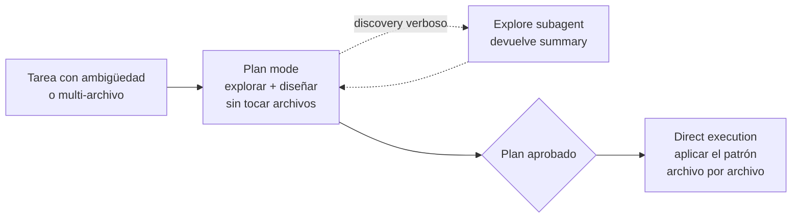

## Explícamelo como si tuviera 5 años

Imagina que vas a cambiar algo en tu casa.

- Si solo hay que **cambiar un foco fundido**, no llamas a un arquitecto ni dibujas planos: sabes cuál foco es, dónde está y cómo se cambia. Subes a la escalera y lo cambias. Eso es **direct execution**.
- Si quieres **tirar una pared para unir la cocina con la sala**, no agarras el martillo de inmediato. Primero revisas si esa pared carga el techo, por dónde pasan los cables y las tuberías, y comparas opciones (¿abrir toda la pared o solo un arco?). Haces el plano **sin romper nada**, y solo cuando el plano está aprobado empiezas a demoler. Eso es **plan mode**.

Y el truco: lo que decide si necesitas planos **no es qué tan difícil es el trabajo, sino qué tan claro está**. Cambiar un foco en un techo de 6 metros es difícil, pero está clarísimo qué hacer → no necesitas planos. Unir dos cuartos "suena fácil", pero hay muchas formas de hacerlo y cosas escondidas en la pared → necesitas planos.

Y si para hacer el plano tienes que revisar cientos de cables y tubos, mandas a un **ayudante** a revisarlo todo y que te traiga solo un resumen en una hoja, para que tu mesa de trabajo no se llene de papeles. Ese ayudante es el **Explore subagent**.

## Argumento

> [!note] Idea central
> Claude Code tiene dos modos de trabajo — **plan mode** y **direct execution** — y elegir entre ellos **no es cuestión de gusto**: hay criterios claros. El criterio decisivo es la **ambigüedad** de la tarea, **no su dificultad**. Tareas con decisiones de arquitectura, varios enfoques válidos o cambios multi-archivo → plan mode. Cambios bien entendidos y de alcance acotado → direct execution. Y en la práctica, lo más común (y lo que el examen evalúa) es **combinarlos**: plan **THEN** direct, no plan **OR** direct.

## Conclusiones

### Plan mode: cuándo usarlo

Plan mode es para tareas complejas donde hay que **explorar el codebase, evaluar varios enfoques y diseñar una estrategia antes de tocar nada**. Úsalo cuando:

- **Large-scale changes**: reestructurar un monolito en microservicios, reorganizar un sistema de módulos, refactorizar una abstracción central — hay que entender la estructura existente antes de cambiarla.
- **Multiple valid approaches**: hay varias formas de resolverlo (ej. distintas arquitecturas de integración con distintos requisitos de infraestructura) y hay que evaluarlas antes de comprometerse.
- **Architectural decisions**: service boundaries, module dependencies, API contracts — decisiones con consecuencias *downstream*. Planear evita **costly rework**.
- **Multi-file modifications**: una library migration que afecta 45+ archivos necesita una estrategia **consistente**; sin plan, la migración se aplica de forma inconsistente entre archivos.
- **Codebase exploration** necesaria: entender dependencias, trazar flujos de datos o mapear la estructura antes de cambiar algo.

> [!note] Lo que hace plan mode
> Permite **safe exploration and design**: Claude lee el codebase, analiza dependencias y propone un enfoque — **todo sin modificar ningún archivo**. No escribe nada a disco hasta que apruebas el plan.

### Cómo se activa plan mode

Plan mode **se activa cambiando de modo, no pidiéndolo en el texto**. Tres rutas:

| Ruta | Cuándo |
|---|---|
| `claude --permission-mode plan` | Al iniciar la sesión |
| `Shift+Tab` | Durante la sesión, hasta que la status bar muestre plan mode activo |
| Prefijo `/plan` en un prompt | Para un solo prompt |

> [!warning] Detalle fino
> Escribir "in plan mode" **dentro del cuerpo** de un prompt **no hace nada**. `/plan` **al inicio** del prompt sí lo activa.

### Direct execution: cuándo usarlo

Direct execution es para **cambios bien entendidos, con alcance claro y limitado**. Úsalo cuando:

- **Well-scoped change**: un single-file bug fix con un stack trace claro, agregar un date validation conditional, actualizar un valor de configuración.
- **El enfoque correcto ya se conoce**: sabes qué cambiar, dónde y cómo — no hay decisión de diseño pendiente.
- **Scope limitado**: una función, un archivo, una modificación clara.

> [!note] Por qué no planear siempre
> Direct execution se salta la fase de planeación y hace los cambios de inmediato. Para tareas simples y bien definidas, **planear no agrega nada** — solo overhead.

### Ambigüedad, no dificultad (el criterio clave)

- La pregunta correcta no es "¿qué tan difícil es?", sino "**¿está claro qué hay que hacer, dónde y cómo?**".
- Un bug **difícil pero bien definido** (stack trace claro, una sola función, causa conocida) → **direct execution**.
- Un feature que **suena simple** pero se puede implementar de tres formas distintas y afecta varios módulos → **plan mode**.

> [!note] Analogía mental
> Es como un GPS: si ya conoces la ruta (aunque sea larga y con tráfico), solo manejas. Si hay tres rutas posibles con peajes, obras y tiempos distintos, primero comparas en el mapa antes de arrancar. Lo que define si abres el mapa es la **incertidumbre de la ruta**, no la distancia.

### El Explore subagent

- En tareas **multi-phase**, la fase de descubrimiento genera mucho output verboso: file listings, dependency graphs, code excerpts, notas de análisis.
- Si todo eso fluye a la conversación principal, **llena el context window** y degrada la calidad de las respuestas posteriores (justo cuando toca implementar).
- El **Explore subagent**:
  1. Corre la exploración **en aislamiento**.
  2. Produce **summaries** de sus hallazgos.
  3. Devuelve solo esos resúmenes a la conversación principal.
  4. Mantiene el context window principal **limpio para la implementación**.
- Úsalo cuando la fase de discovery es verbosa pero la de implementación necesita contexto enfocado — para prevenir **context window exhaustion**.

### El patrón híbrido: plan THEN execute

Combinar plan mode para investigar con direct execution para implementar es **común en la práctica y evaluado en el examen**:

1. **Plan phase** (plan mode): explorar el codebase, entender dependencias, evaluar enfoques y diseñar la estrategia de implementación.
2. **Execute phase** (direct execution): implementar el enfoque planeado, archivo por archivo, con la estrategia ya decidida.

> [!example] Ejemplo de la guía — migrar de una logging library a otra en 30 archivos
> - **Plan**: identificar todos los archivos que importan la library vieja, mapear las diferencias de API entre la vieja y la nueva, diseñar el migration pattern, revisar edge cases.
> - **Execute**: aplicar el migration pattern a cada archivo usando el enfoque planeado.

> [!note] Frase para memorizar
> Es **plan THEN direct**, no **plan OR direct**.

### Decision framework (tabla de la guía)

| Característica de la tarea | Modo |
|---|---|
| Architectural restructuring | Plan mode |
| Library migration (muchos archivos) | Plan mode (luego direct execution) |
| Multiple valid implementation approaches | Plan mode |
| Codebase exploration necesaria | Plan mode (con Explore subagent) |
| Single-file bug fix con stack trace claro | Direct execution |
| Agregar un validation check a una función | Direct execution |
| Actualizar un valor de configuración | Direct execution |
| Fix conocido, ubicación conocida, enfoque conocido | Direct execution |

### Reconocer la complejidad desde el inicio

- Si los **requisitos ya dicen** que la tarea es compleja (ej. "restructure the monolith into microservices"), se elige plan mode **de entrada**.
- La complejidad **no va a "aparecer después"** — ya está en la descripción de la tarea. Es conocida, no especulativa.
- Empezar en direct execution y "esperar sorpresas" para cambiar a plan mode es el movimiento incorrecto.

## Evidencia

- **Sample Question 5 del examen oficial**: reestructurar una aplicación monolítica en microservicios, con cambios en decenas de archivos y decisiones sobre service boundaries y module dependencies → la respuesta correcta es entrar en plan mode para explorar, entender dependencias y diseñar el enfoque antes de cambiar nada.
- Ejemplos de "Skills in" del Task Statement 3.4: plan mode para microservice restructuring, library migrations que afectan 45+ archivos, o elegir entre integration approaches con distintos requisitos de infraestructura; direct execution para un single-file bug fix con stack trace claro o agregar un date validation conditional.

## Trampas de examen

> [!warning] Trampa 1 — Direct execution por default en cambios arquitectónicos multi-archivo
> **Error común:** empezar a cambiar código directamente en una tarea que afecta muchos archivos y tiene varios enfoques válidos.
> **Por qué está mal:** las dependencias se descubren tarde y eso provoca **costly rework**; además, sin estrategia común, los cambios quedan inconsistentes entre archivos.
> **Forma correcta:** si hay decisiones de arquitectura o muchos archivos afectados → **plan first**.

> [!warning] Trampa 2 — Plan mode para un single-file bug fix con stack trace claro
> **Error común:** "por seguridad" planear un fix de una sola función con causa conocida.
> **Por qué está mal:** es el caso de libro de direct execution; cuando problema, ubicación y solución están claros, plan mode solo agrega **overhead innecesario**. Recuerda: aunque el bug sea *difícil*, si no es *ambiguo*, no se planea.
> **Forma correcta:** direct execution.

> [!warning] Trampa 3 — No reconocer el patrón híbrido plan-then-execute
> **Error común:** tratar la decisión como excluyente ("¿plan mode **o** direct execution?") para una library migration.
> **Por qué está mal:** el examen espera que combines ambos — plan mode para investigar y diseñar la estrategia, direct execution para aplicarla.
> **Forma correcta:** plan **THEN** direct.

> [!warning] Trampa 4 — Empezar en direct execution y cambiar a plan mode solo cuando "aparezca" la complejidad
> **Error común:** "empiezo directo y si se complica, planeo".
> **Por qué está mal:** cuando la complejidad ya está **declarada en los requisitos** (ej. monolith restructuring), es conocida, no especulativa. Esperar sorpresas es el error.
> **Forma correcta:** elegir plan mode **upfront**. Esta es exactamente la opción D incorrecta de la **Sample Question 5** oficial.

> [!warning] Trampa 5 — "Pedir" plan mode en el texto del prompt
> **Error común:** escribir "hazlo en plan mode" dentro del prompt y asumir que Claude no tocará archivos.
> **Por qué está mal:** plan mode es un **modo** que se activa (`--permission-mode plan`, `Shift+Tab`, o `/plan` al inicio del prompt); el texto en el cuerpo del prompt no hace nada.
> **Forma correcta:** cambiar de modo con una de las tres rutas.

## En una frase

Elige el modo por **ambigüedad, no por dificultad**: plan mode (explorar y diseñar sin tocar archivos, con el Explore subagent para el discovery verboso) cuando hay arquitectura, varios enfoques o muchos archivos; direct execution cuando qué, dónde y cómo ya están claros — y para migraciones grandes, **plan THEN direct**.

---

> [!tip] Repasa esto en [[3 cuestionario]], aplícalo en [[2 example]] y evalúate en [[4 test]]
