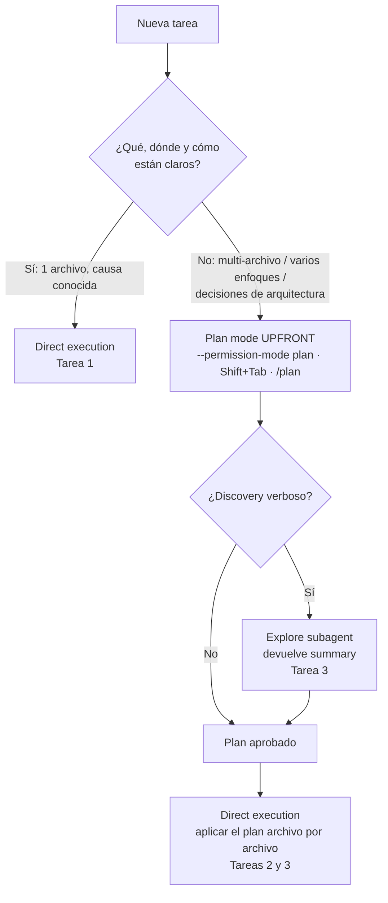

Aplicación práctica de [[1 resumen]]

## Caso de uso

Un equipo mantiene un backend en Python (`src/`, ~120 archivos). Esta semana tiene tres tareas en el backlog:

1. **Bug en producción**: un `AttributeError: 'NoneType' object has no attribute 'email'` con stack trace que apunta a una sola función, `src/billing/invoices.py:build_invoice`.
2. **Library migration**: migrar el logging de la stdlib `logging` a `structlog` en **~30 archivos**.
3. **Nuevo feature**: "notificar al cliente cuando una factura vence" — suena simple, pero puede hacerse con un cron job, con una cola de mensajes, o con webhooks de un proveedor externo, cada uno con distintos requisitos de infraestructura.

Como este tema es sobre **cómo operar Claude Code**, el "código" del ejemplo son principalmente comandos de CLI (Bash) y los prompts que se le dan a Claude, más el código Python que resulta de cada tarea. Vamos a clasificar cada tarea con el [[1 resumen#Decision framework (tabla de la guía)|decision framework]] y ejecutarla con el modo correcto.

### Paso 1 — Clasificar las tareas por ambigüedad, no por dificultad

Antes de abrir Claude Code, aplicamos la pregunta clave de [[1 resumen#Ambigüedad, no dificultad (el criterio clave)]]: *¿está claro qué hay que hacer, dónde y cómo?*

| Tarea | ¿Qué? | ¿Dónde? | ¿Cómo? | Modo |
|---|---|---|---|---|
| 1. Bug `NoneType` | Claro (stack trace) | 1 función | Claro (falta un guard) | **Direct execution** |
| 2. Migración a `structlog` | Claro | ~30 archivos | A diseñar (mapeo de APIs, edge cases) | **Plan mode → direct execution** |
| 3. Notificación de vencimiento | Claro a alto nivel | Varios módulos | 3 enfoques válidos | **Plan mode** (con Explore subagent) |

> [!warning] Pregunta trampa — "la tarea 1 es la más urgente y la de producción, ¿no debería planearse con más cuidado?"
> No. La urgencia o dificultad no cambian el modo: el problema, la ubicación y la solución están claros, así que planear solo agrega overhead ([[1 resumen#Trampas de examen|Trampa 2]]). Y al revés: la tarea 3 "suena" fácil, pero tiene tres enfoques válidos → plan mode.

### Paso 2 — Tarea 1: direct execution para el single-file bug fix

Iniciamos Claude Code en el modo por defecto (sin plan mode) y le damos el stack trace completo:

```bash
claude
```

```text
> Fix this bug. Stack trace:
  File "src/billing/invoices.py", line 42, in build_invoice
    recipient = customer.contact.email
AttributeError: 'NoneType' object has no attribute 'email'
Customers without a contact record should fall back to customer.billing_email.
```

Claude va directo a la función y aplica el cambio:

```python
# src/billing/invoices.py
def build_invoice(customer, items):
    # Fix: los clientes sin contact record caen al billing_email
    recipient = (
        customer.contact.email
        if customer.contact is not None
        else customer.billing_email
    )
    ...
```

> [!note] Por qué direct execution aquí
> Una función, una causa conocida, un fix conocido. Es exactamente la fila "Single-file bug fix con stack trace claro → Direct execution" de la tabla.

> [!warning] Forma ingenua — iniciar la sesión con `claude --permission-mode plan` para este bug
> ```bash
> # ❌ Overkill para un fix de una línea con causa conocida
> claude --permission-mode plan
> ```
> Claude leería el módulo, propondría un plan de un paso, esperaría aprobación... para terminar haciendo el mismo cambio de 3 líneas. Overhead sin beneficio.

### Paso 3 — Tarea 2, fase Plan: diseñar la library migration sin tocar archivos

Esta tarea toca ~30 archivos y requiere una estrategia **consistente**. Entramos en plan mode **desde el inicio** — la complejidad ya está en el enunciado ("30 archivos"), no hay que esperar a que "aparezca":

```bash
# Ruta 1: iniciar la sesión directamente en plan mode
claude --permission-mode plan
```

(Alternativas equivalentes dentro de una sesión ya abierta: presionar `Shift+Tab` hasta que la status bar muestre plan mode, o prefijar un solo prompt con `/plan`.)

```text
> Plan a migration from the stdlib `logging` module to `structlog` across src/.
  1. Identify every file that imports or configures `logging`.
  2. Map the API differences (getLogger, %-style formatting, extra={...}, exc_info).
  3. Design one migration pattern we can apply uniformly to every file.
  4. Flag edge cases (custom handlers, logging in tests, third-party log capture).
```

Claude lee el codebase, analiza dependencias y devuelve un plan — **sin modificar ningún archivo**. Un plan típico se ve así:

```text
Migration plan (proposed):
- 31 files import `logging`; 2 configure handlers (src/app.py, src/workers/main.py)
- Pattern per file:
    logger = logging.getLogger(__name__)      ->  logger = structlog.get_logger(__name__)
    logger.info("Paid %s", invoice_id)        ->  logger.info("invoice_paid", invoice_id=invoice_id)
    logger.error("...", exc_info=True)        ->  logger.exception("...")
- Central config: add src/logging_config.py with structlog.configure(...), call it from both entrypoints
- Edge cases: tests using caplog (keep stdlib bridge via structlog.stdlib.LoggerFactory)
```

> [!warning] Forma ingenua — pedir plan mode dentro del texto del prompt
> ```text
> # ❌ Esto NO activa plan mode
> > In plan mode, please migrate our logging to structlog.
> ```
> Escribir "in plan mode" en el cuerpo del prompt no hace nada: Claude puede empezar a editar archivos directamente. Plan mode es un **modo** — se activa con `--permission-mode plan`, `Shift+Tab` o `/plan` **al inicio** del prompt ([[1 resumen#Cómo se activa plan mode]]).

> [!warning] Forma ingenua — direct execution "incremental" para la migración
> ```text
> # ❌ Empezar a migrar archivo por archivo sin estrategia
> > Replace logging with structlog in src/billing/invoices.py
> > Now do src/billing/payments.py
> > ...
> ```
> Sin un migration pattern decidido de antemano, cada archivo termina con un estilo distinto (unos con eventos key-value, otros con f-strings), y los edge cases (handlers custom, `caplog` en tests) aparecen tarde → **costly rework** ([[1 resumen#Trampas de examen|Trampa 1]]).

### Paso 4 — Tarea 2, fase Execute: aplicar el plan con direct execution

Con el plan aprobado, salimos de plan mode (al aprobar el plan, o con `Shift+Tab`) y ejecutamos. Ya no hay decisiones de diseño: solo aplicar el patrón.

```text
> Apply the approved migration pattern file by file. Start with src/logging_config.py
  and the two entrypoints, then the remaining 29 files.
```

Resultado en cada archivo, idéntico en forma gracias al plan:

```python
# src/billing/payments.py — después de la migración
import structlog

logger = structlog.get_logger(__name__)

def register_payment(invoice_id: str, amount: float) -> None:
    logger.info("payment_registered", invoice_id=invoice_id, amount=amount)
```

> [!note] Plan THEN direct, no plan OR direct
> Este par de pasos (3 y 4) es el **patrón híbrido** que evalúa el examen ([[1 resumen#El patrón híbrido: plan THEN execute]]): plan mode para investigar y diseñar, direct execution para implementar con la estrategia ya decidida.

### Paso 5 — Tarea 3: plan mode + Explore subagent para un discovery verboso

La tarea 3 tiene **multiple valid approaches** (cron job vs cola de mensajes vs webhooks), cada uno con distintos requisitos de infraestructura. Además, para decidir hay que entender cómo están hoy el scheduler, los workers y la integración de email — un discovery que genera muchísimo output.

Entramos en plan mode para un solo prompt con `/plan`, y delegamos el discovery al Explore subagent:

```text
> /plan We need to notify customers when an invoice becomes overdue.
  Use the Explore subagent to map how scheduling, background workers and email
  sending currently work in src/ (entrypoints, queues, cron configs, email clients).
  Have it return only a concise summary. Then compare three approaches
  (cron job, message queue consumer, provider webhooks) with their infrastructure
  requirements and recommend one.
```

Lo que pasa por dentro:

- El **Explore subagent** recorre el codebase en aislamiento: file listings, grep de `celery`/`cron`/`smtp`, excerpts de código, dependency graph. Todo ese output verboso **se queda en su propio contexto**.
- A la conversación principal solo regresa un **summary**:

```text
Explore summary:
- Background jobs: Celery with Redis broker (src/workers/), beat schedule in src/workers/schedule.py
- Email: src/notifications/email.py wraps the provider SDK; no webhook endpoints exist yet
- Invoices: due_date on Invoice model; no "overdue" status transitions today
```

- Con ese resumen, Claude (aún en plan mode) compara enfoques y recomienda, p. ej., una tarea periódica en Celery beat (reutiliza la infraestructura existente, sin exponer endpoints nuevos).

> [!warning] Forma ingenua — hacer todo el discovery en la conversación principal
> ```text
> # ❌ Todo el output del discovery cae en el contexto principal
> > List every file in src/, show me all the Celery code, all email code,
>   and all cron configs so we can decide.
> ```
> Cientos de líneas de listings y excerpts llenan el context window, y la calidad de las respuestas posteriores — justo en la fase de implementación — se degrada (**context window exhaustion**). El Explore subagent aísla ese ruido y devuelve solo lo que importa ([[1 resumen#El Explore subagent]]).

Una vez elegido el enfoque, la implementación vuelve a ser **plan THEN direct**: se aprueba el plan y se ejecuta en direct execution.

### Paso 6 — Anti-patrón: "empiezo directo y si se complica, planeo"

Supongamos que el líder técnico dice: *"Arranquemos la tarea 3 en direct execution; si se complica, cambiamos a plan mode."*

```text
# ❌ Reactivo: la complejidad ya estaba declarada en el requisito
> Add overdue invoice notifications.
  ... (Claude elige un enfoque al vuelo, crea un endpoint de webhook,
       tras 8 archivos modificados se descubre que ya existía Celery beat)
> Hmm, let's switch to plan mode and rethink this.
```

> [!warning] Por qué está mal
> "Tres enfoques válidos con distintos requisitos de infraestructura" ya estaba en el enunciado: la complejidad era **conocida, no especulativa**. Esperar a que "aparezcan sorpresas" produjo 8 archivos de rework. La forma correcta es elegir plan mode **upfront** ([[1 resumen#Reconocer la complejidad desde el inicio]]) — exactamente lo que evalúa la Sample Question 5 del examen oficial.

### Resumen del flujo completo


