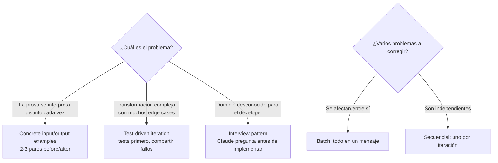

> [!note] En una frase
> Cuando Claude Code no da el resultado correcto a la primera, no se arregla escribiendo "más y mejor prosa": se elige la técnica según el problema — **ejemplos concretos de input/output** si interpreta distinto cada vez, **test-driven iteration** si la transformación es compleja, **interview pattern** si el dominio te es desconocido — y el feedback se manda **todo junto si los problemas interactúan**, o **uno por uno si son independientes**.

## Explícamelo como si tuviera 5 años

Imagina que le pides a alguien que te corte el pelo "más o menos corto, pero no tanto, con un estilo moderno". Cada vez que vas, sales con un corte distinto — no porque el peluquero sea malo, sino porque ~={red}tus palabras se pueden entender de mil maneras=~. ¿La solución? No es explicarlo con palabras más elegantes: es **enseñarle 2 o 3 fotos** del corte que quieres. Con las fotos ya no hay nada que interpretar.

Ahora imagina que el trabajo es más complicado, como armar un mueble con muchas piezas. En vez de describir cómo debe quedar, le das una **lista de revisión**: "la puerta debe cerrar", "el cajón no debe trabarse", "debe aguantar 20 kg". Cuando algo falla, le dices exactamente cuál punto de la lista falló — "la puerta no cierra" — y no hay discusión posible. Eso son los **tests**.

Y si te toca algo de lo que no sabes nada — digamos, construir una casa — lo inteligente no es darle órdenes al arquitecto, sino **dejar que él te haga preguntas primero**: "¿cuántas personas vivirán ahí?", "¿hay temblores en la zona?". Esas preguntas te revelan cosas en las que tú ni habías pensado. Eso es el **interview pattern**.

Por último, cómo das las correcciones: si pides "cambia el color de la pared" y "cambia las cortinas para que combinen con la pared", tienes que decirlo **todo junto** (una cosa depende de la otra). Pero "arregla la llave del baño" y "poda el jardín" no tienen nada que ver entre sí — mejor **una a la vez**.

## Argumento central

> **Jerarquía de técnicas**: trabajar con Claude Code es iterativo — la primera salida rara vez es la final. El examen evalúa que conozcas las técnicas específicas para guiar a Claude Code al resultado correcto y, sobre todo, **cuál usar primero en cada situación**. Cada técnica resuelve un problema distinto; elegir la equivocada (ej. refinar prosa ante interpretación inconsistente) no arregla nada.
>
> **Entrega del feedback**: *cómo* entregas el feedback importa tanto como *qué* dices — ==**batch** (un solo mensaje) cuando los arreglos interactúan entre sí; **secuencial** cuando los problemas son independientes==.



## Ideas clave (Conclusiones)

### 1. Concrete input/output examples — la primera técnica ante interpretación inconsistente

- **Cuándo**: describes una transformación de código en prosa y Claude Code la interpreta distinto cada vez.
- **El arreglo no es más prosa, son ejemplos concretos**: 2-3 ejemplos mostrando el input exacto y el output exacto esperado.
- **Por qué funciona**: "el modelo generaliza a partir de estos ejemplos de forma más confiable que a partir de cualquier descripción en prosa". Dos o tres ejemplos fijan el patrón y el modelo lo aplica a casos nuevos.

Ejemplo de la guía — envolver los tipos de retorno en `Result<T, ApiError>`:

```text
Input:
  getUserData(userId: string): Promise<UserData>
Expected output:
  getUserData(userId: string): Promise<Result<UserData, ApiError>>
```

```text
Input:
  fetchOrders(customerId: string): Promise<Order[]>
Expected output:
  fetchOrders(customerId: string): Promise<Result<Order[], ApiError>>
```

> [!note] Analogía rápida
> Prosa = describirle a alguien un color por teléfono. Ejemplos = mandarle la muestra de pintura. La prosa más precisa del mundo sigue dependiendo de interpretación; la muestra no.

### 2. El proceso de comunicación basada en ejemplos (4 pasos)

1. **Observar la inconsistencia**: describes la transformación y Claude Code la hace distinta cada vez.
2. **Cambiar a ejemplos**: 2-3 pares concretos before/after con la transformación exacta.
3. **Verificar la generalización**: probar con un caso nuevo para confirmar que el modelo generaliza el patrón correctamente.
4. **Agregar ejemplos de edge cases si hace falta**: si maneja el caso estándar pero falla en edge cases, agregar ejemplos que muestren específicamente ese manejo.

> [!note] No se trata de apilar ejemplos
> "Dos o tres bien elegidos que cubran el caso estándar y un edge case clave son suficientes." El modelo generaliza el patrón — no hace falta darle cada caso posible.

### 3. Test-driven iteration — la técnica para transformaciones complejas

- **Primero los tests**: definir el comportamiento esperado con test cases que cubran:
  - **Happy path** — la transformación estándar esperada.
  - **Edge cases** — valores `null`, inputs vacíos, condiciones de frontera.
  - **Performance requirements** — si aplican.
- **Luego compartir los test failures** con Claude Code. Los fallos dan feedback concreto e inequívoco: ~={red}no hay espacio para interpretación cuando el output dice "Expected X, got Y"=~.

Ejemplo de la guía — un script de migración que maneja mal los nulos:

```text
FAIL: testMigrationHandlesNullValues
  Expected: null preserved in output JSON
  Actual: null replaced with empty string ""
```

> [!note] Relación con la técnica 1
> Un test case con input de ejemplo y output esperado **es** un ejemplo concreto, pero ejecutable y repetible. Por eso el examen pide "proveer test cases específicos con input de ejemplo y output esperado" para arreglar el manejo de edge cases (ej. valores `null` en scripts de migración).

### 4. Interview pattern — la técnica para dominios desconocidos

- **Cuándo**: trabajas en un dominio donde te falta experiencia y podrías pasar por alto consideraciones importantes.
- **Qué hace**: en vez de prescribir una solución, le pides a Claude que **haga preguntas antes de implementar** — así salen a la luz consideraciones que no habías anticipado.
- Contraste de la guía:
  - ❌ Prescribir: *"Build me a caching layer for the API"*
  - ✅ Interview: *"I need a caching layer for the API. Before implementing, ask me questions about the requirements, edge cases, and constraints I should consider."*
- Claude podría preguntar por **cache invalidation strategies**, **TTL policies**, **consistency requirements** y **failure modes** — cosas que un experto sabría abordar pero que tú podrías omitir.

> [!warning] Key Concept de la guía — no confundir interview con examples
> - **Interview pattern** → dominio desconocido; *el developer* podría no ver consideraciones importantes.
> - **Concrete examples** → el developer **sabe exactamente** la transformación que quiere, pero *el modelo* la interpreta de forma inconsistente.
>
> Resuelven problemas distintos. La pregunta clave: ¿el hueco de conocimiento está en ti (→ interview) o en cómo el modelo lee tu descripción (→ examples)?

### 5. Batch vs sequential feedback

| Situación | Cómo entregar el feedback | Por qué |
|---|---|---|
| Los arreglos **interactúan** (arreglar A afecta a B) | **Batch** — todo en un solo mensaje | El modelo necesita ver todas las restricciones a la vez para producir un arreglo coherente |
| Los problemas son **independientes** | **Secuencial** — uno por iteración | Mezclar problemas independientes puede confundir al modelo sobre qué feedback aplica a qué parte del código |

- **Ejemplo batch (guía)**: cambiar el patrón de error handling también afecta el formato de logging y la estructura de respuesta → los tres en un mensaje:
  1. Las error responses deben incluir un campo de error code.
  2. El logging debe incluir el error code en formato estructurado.
  3. Las type definitions del client SDK deben reflejar el nuevo campo.
- **Ejemplo secuencial (guía)**: naming (camelCase) e indentación (2 espacios) no se afectan → primero uno, esperar resultado, luego el otro.

> [!note] Qué pasa si secuencias problemas que interactúan
> El modelo arregla uno de una forma que choca con los demás — cada arreglo puede entrar en conflicto con el siguiente, en lugar de un solo arreglo coherente.

### 6. Tabla resumen: qué técnica en qué situación

| Situación | Técnica |
|---|---|
| Descripción en prosa interpretada distinto cada vez | Concrete input/output examples |
| Transformación compleja con muchos edge cases | Test-driven iteration |
| Trabajar en un dominio desconocido | Interview pattern |
| Varios problemas que se afectan entre sí | Batch feedback (un mensaje) |
| Varios problemas independientes | Sequential feedback |

## Trampas de examen

> [!warning] Trampa 1 — Refinar la prosa cuando el modelo la interpreta de forma inconsistente
> **Error común**: reescribir la descripción "con lenguaje más preciso y terminología técnica".
> **Por qué está mal**: una prosa más precisa **sigue dependiendo de interpretación**. Los ejemplos concretos de input/output eliminan la ambigüedad.
> **Correcto**: ante interpretación inconsistente, la respuesta es **siempre ejemplos primero**, no mejor prosa. (Es exactamente el Practice Scenario de la guía: la respuesta correcta es "2-3 concrete input/output examples", y el distractor es "rewrite the prose with more precise language".)

> [!warning] Trampa 2 — No reconocer cuándo hacer batch vs secuencial
> **Error común**: mandar uno por uno problemas que se afectan entre sí (o juntar en un mensaje problemas que no tienen relación).
> **Por qué está mal**: si los problemas interactúan, el modelo necesita ver todas las restricciones a la vez; si son independientes, juntarlos lo confunde.
> **Correcto**: pregúntate "¿arreglar A cambia B?" — sí → un mensaje; no → secuencial. El examen evalúa esta distinción directamente.

> [!warning] Trampa 3 — Confundir el interview pattern con la técnica de ejemplos
> **Error común**: usar interview pattern cuando el developer ya sabe exactamente qué quiere (o dar ejemplos cuando no sabe qué considerar).
> **Por qué está mal**: resuelven problemas distintos — interview para dominios desconocidos donde podrías omitir consideraciones; ejemplos para cuando sabes la transformación exacta pero el modelo la malinterpreta.
> **Correcto**: diagnostica primero dónde está el hueco (en ti o en la interpretación del modelo) y luego elige.

> [!warning] Trampa 4 — Creer que más ejemplos siempre es mejor
> **Error común**: intentar cubrir cada caso posible con decenas de ejemplos.
> **Correcto**: 2-3 bien elegidos (caso estándar + un edge case clave) bastan; el modelo generaliza el patrón. Si falla un edge case, se agrega un ejemplo específico de ese edge case.

## Fuentes citadas por la guía
- Claude Certification Guide — módulo "Iterative Refinement Techniques" (`/learn/3-claude-code-config/3-5-iterative-refinement`)
- `examguide.pdf` — Task Statement 3.5: "Apply iterative refinement techniques for progressive improvement"
- Claude Code Iterative Development Documentation — Anthropic

---
> [!tip] Sigue con este tema
> Repasa con [[3 cuestionario]], aplícalo en código en [[2 example]], y evalúate con [[4 test]].
