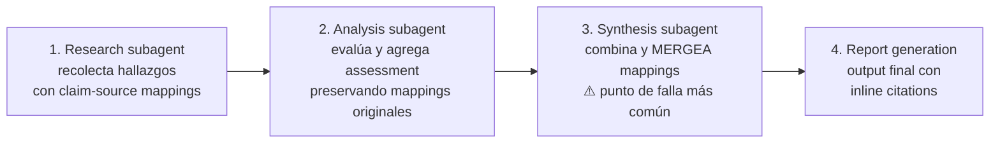

---
tags:
  - claude-cert/dominio-5
  - task-statement/5.6
---

# 5.6 — Information Provenance & Multi-Source Synthesis

## Explícamelo como si tuviera 5 años

Imagina que haces una tarea de la escuela sobre dinosaurios. Tu amiga lee un libro, tu primo busca en internet y tú juntas todo en una sola cartulina. Si en la cartulina solo escribes "los dinosaurios eran enormes", la maestra te pregunta: "¿quién lo dijo? ¿qué tan enormes? ¿de dónde lo sacaste?" — y ya no sabes, porque al juntar todo borraste de dónde venía cada dato.

Y si tu amiga dice "el T-Rex medía 12 metros" y tu primo dice "medía 13 metros", no puedes simplemente elegir uno al azar: lo honesto es escribir los dos, decir quién dijo cada uno, y quizá notar que el libro de tu amiga es viejito y el sitio de tu primo es nuevo.

Eso es el tema: en un sistema de investigación con varios agentes, cada dato tiene que llevar pegada su "etiqueta de origen" (de dónde salió, qué dice exactamente la fuente, y cuándo se publicó), y esa etiqueta no se puede perder cuando otro agente junta todo en un reporte final.

## Argumento central

> [!note] Idea central
> **Information provenance** — saber de dónde viene cada afirmación y cuánta confianza merece — es la diferencia entre un sistema de investigación que produce resultados confiables y uno que produce "ficción que suena plausible". La atribución **muere durante la summarisation** a menos que se preserve explícitamente con **structured claim-source mappings** a lo largo de todo el pipeline.

De ahí salen tres cosas que el examen evalúa:

1. Cómo la atribución sobrevive (o muere) a través de un pipeline de síntesis multi-agente.
2. Cómo manejar **fuentes en conflicto** (anotar, nunca elegir arbitrariamente).
3. Cómo el **contexto temporal** evita falsas contradicciones.

## Conclusiones

### 1. Structured claim-source mappings

Cada hallazgo en un sistema de investigación multi-agente debe cargar su procedencia. **No es metadata opcional**: es la garantía estructural de que el output final se puede rastrear hasta fuentes específicas.

Cada hallazgo debe incluir 5 campos:

| Campo | Qué es |
|---|---|
| **Claim** | La afirmación específica |
| **Source URL** | Dónde se encontró la información |
| **Document name** | El título del documento fuente |
| **Relevant excerpt** | El pasaje específico que sostiene el claim |
| **Publication date** | Cuándo se publicó la fuente o se recolectaron los datos |

Ejemplo de la guía:

```json
{
  "claim": "Global renewable energy investment reached $495 billion in 2023",
  "sourceUrl": "https://example.com/iea-report-2024",
  "documentName": "IEA World Energy Investment Report 2024",
  "relevantExcerpt": "Total investment in renewable energy technologies reached approximately $495 billion in calendar year 2023, representing a 17% increase over 2022.",
  "publicationDate": "2024-06-15"
}
```

> [!note] Analogía
> El claim-source mapping es como la etiqueta de un frasco en un laboratorio: contenido, proveedor, lote y fecha. Un frasco sin etiqueta puede contener exactamente lo correcto, pero ya no sirve para nada porque nadie puede verificarlo.

- Los subagentes deben **producir** sus hallazgos en este formato **desde el inicio**: si devuelven prosa no estructurada, la atribución ya se perdió antes de llegar a la síntesis.

### 2. La atribución muere en la summarisation (y hay que cargarla por todo el pipeline)

Cuando un agente de síntesis combina hallazgos de varios subagentes, de forma natural **comprime y parafrasea**. Sin instrucciones explícitas de preservar los mappings, produce frases como *"Investment in renewable energy has grown significantly"* — sin monto, sin fuente, sin fecha.

La atribución tiene que sobrevivir **cada paso** del pipeline:



- El punto de falla **más común es el paso 3 (synthesis)**: combina y parafrasea sin llevar los mappings hacia adelante.
- El prompt del synthesis agent debe **exigir explícitamente** que cada claim de su output sea rastreable a una fuente específica.
- Tres requisitos concretos:
  1. Los subagentes devuelven hallazgos en el formato claim-source estructurado.
  2. El synthesis agent tiene instrucción de **mantener y mergear** esos mappings al combinar.
  3. El output final incluye **inline citations** o una **sección de referencias estructurada** que liga cada claim a su fuente.

> [!note] Conexión con 5.1
> Es la misma idea que la progressive summarisation trap de [[5 Context Management & Reliability/1 Context Window Management/1 resumen|5.1]]: comprimir destruye lo preciso. Allá se pierden montos y fechas; aquí se pierde **de dónde salió** cada dato.

### 3. Conflict handling: anotar, nunca elegir arbitrariamente

Cuando dos fuentes **creíbles** reportan estadísticas distintas para la misma medida, el synthesis agent enfrenta una decisión crítica.

- ❌ **Incorrecto** (lo que el examen busca que detectes): elegir la fuente más reciente, **promediar** los valores, o escoger la del publisher "más autoritativo".
- ✅ **Correcto**: anotar **ambos valores con atribución completa** y dejar que el consumidor decida.

Ejemplo de la guía:

```markdown
Market growth estimates vary by source:
- **12% growth** — IEA World Energy Report (published June 2024, using 2023 calendar year data)
- **8% growth** — Bloomberg NEF Annual Review (published March 2024, using July 2022–June 2023 data)
The difference may reflect different reporting periods and methodological approaches.
```

- Elegir un valor arbitrariamente **destruye información** y presenta una **falsa certeza**.
- Anotar ambos preserva el panorama completo: el consumidor ve los dos valores, entiende las fuentes y juzga cuál es más relevante para su necesidad.
- La anotación incluye el **contexto metodológico** (periodo de reporte, método) que puede explicar la diferencia.

### 4. Completar el análisis con los conflictos intactos

Cuando el agente de document analysis encuentra valores en conflicto, debe **terminar su trabajo con los conflictos incluidos y anotados explícitamente**. **No debe resolver el conflicto** — esa decisión le pertenece al **coordinator** (o al consumidor).

Ejemplo de la guía:

```json
{
  "field": "annualRevenue",
  "conflictDetected": true,
  "values": [
    {
      "value": "$4.2M",
      "source": "Annual Report 2023",
      "context": "Audited financial statements, fiscal year ending December 2023"
    },
    {
      "value": "$3.8M",
      "source": "SEC Filing Q4 2023",
      "context": "Preliminary unaudited figures, calendar year 2023"
    }
  ],
  "possibleExplanation": "Difference may reflect audited vs preliminary figures and fiscal vs calendar year reporting periods"
}
```

El coordinator decide qué hacer con el conflicto **antes de pasar a síntesis**:

- presentar ambos valores,
- investigar más, o
- escalar a un analista humano.

> [!note] Analogía
> El analista es como un perito que reporta "la huella A coincide con el sospechoso 1 y la huella B con el sospechoso 2". No es su trabajo dictar sentencia; eso le toca al juez (el coordinator).

### 5. Temporal awareness: fechas distintas explican números distintos

Números diferentes con fechas diferentes **no son una contradicción**: son contexto temporal, y hay que preservarlo.

| Sin fechas | Con fechas |
|---|---|
| Fuente A: 8% · Fuente B: 12% → "se contradicen" | Fuente A (2023): 8% · Fuente B (2024): 12% → **el crecimiento se aceleró** |

- El "conflicto" en realidad es una **tendencia**.
- Por eso se **exigen fechas de publicación / recolección de datos en todos los structured outputs**. No es "housekeeping": es lo que hace posible la interpretación correcta.
- Sin contexto temporal, tendencias válidas se leen como problemas de calidad de datos, y el synthesis agent puede **marcar o suprimir incorrectamente** hallazgos que en realidad son consistentes.
- Responsabilidad compartida:
  - los **subagentes** incluyen las fechas en su output estructurado,
  - el **synthesis agent** las preserva durante el merge,
  - el **output final** las presenta junto a los datos que describen.

### 6. Reportes que distinguen lo well-established de lo contested

Los reportes deben tener **secciones explícitas** que separen los **well-established findings** de los **contested findings**, preservando las **caracterizaciones originales de las fuentes** y su **contexto metodológico**.

- Un hallazgo sostenido por **tres fuentes independientes** no es igual a uno basado en **un solo reporte**, aunque en el texto ambos se presenten con la misma confianza.
- Separarlos evita que el lector trate un dato disputado con la misma certeza que un consenso.

### 7. Content-appropriate rendering

La síntesis **no debe aplanar todo a un formato uniforme**. Se elige el formato según el tipo de contenido:

| Tipo de contenido | Formato | Por qué |
|---|---|---|
| **Financial data** | Tablas | Números, comparaciones y tendencias se leen y comparan mejor en columnas |
| **News / current events** | Prosa | Contexto narrativo, causa-efecto y desarrollo cronológico fluyen como párrafos |
| **Technical findings** | Listas estructuradas | Patrones de arquitectura, specs de API y opciones de configuración se entienden mejor con jerarquía |

Ejemplo de la guía (financial data como tabla):

| Year | Investment ($B) | Growth (%) |
|---|---|---|
| 2021 | 366 | 12% |
| 2022 | 423 | 16% |
| 2023 | 495 | 17% |

- Forzar todo a un solo formato (todo tablas, todo prosa, o todo listas) **degrada la legibilidad y la comprensión**.

## En una frase

> Cada claim viaja con su etiqueta (claim + source URL + document name + excerpt + fecha) a través de todo el pipeline — sobre todo por la síntesis, donde más se pierde —; los conflictos se anotan con ambos valores y se dejan al coordinator/consumidor, las fechas convierten falsas contradicciones en tendencias, y cada tipo de contenido se presenta en su formato natural.

## Trampas de examen

> [!warning] Trampa 1 — Elegir la fuente más reciente cuando dos fuentes creíbles se contradicen
> Parece razonable ("lo más nuevo es lo más confiable"), pero es una selección arbitraria. **Por qué es un error:** elegir un valor destruye información y presenta falsa certeza. Lo mismo aplica a **promediar** o elegir el publisher "más autoritativo". **Forma correcta:** anotar ambos valores con atribución de fuente y fechas de publicación, y dejar que el consumidor decida.

> [!warning] Trampa 2 — Asumir que números distintos de fuentes distintas son contradicciones
> **Por qué es un error:** fechas de publicación o de recolección de datos diferentes suelen explicar los números distintos — muchas veces es una tendencia, no un conflicto. **Forma correcta:** exigir fechas en los structured outputs de los subagentes para permitir la interpretación temporal correcta.

> [!warning] Trampa 3 — Dejar que el synthesis agent parafrasee sin preservar los claim-source mappings
> **Por qué es un error:** la atribución muere en la summarisation; el paso de síntesis es el punto de falla más común, y sin mappings el output es intrazable ("plausible-sounding fiction"). **Forma correcta:** el synthesis agent debe preservar y mergear explícitamente los mappings, y su prompt debe exigir que cada claim sea rastreable a una fuente.

> [!warning] Trampa 4 — Renderizar todos los tipos de contenido en un formato uniforme
> **Por qué es un error:** aplanar todo a solo prosa, solo tablas o solo listas degrada la legibilidad. **Forma correcta:** financial data como tablas, news como prosa, technical findings como listas estructuradas.

> [!warning] Trampa 5 — Que el agente de análisis "resuelva" el conflicto por su cuenta
> **Por qué es un error:** decidir cuál valor es el bueno no es su responsabilidad; al hacerlo oculta información al coordinator. **Forma correcta:** completar el análisis con los valores en conflicto incluidos y anotados (`conflictDetected`, `values`, `possibleExplanation`), y dejar que el coordinator decida — presentar ambos, investigar más o escalar a un humano — antes de pasar a síntesis.

---

> [!tip] Repasa esto en [[3 cuestionario]], aplícalo en [[2 example]] y evalúate en [[4 test]]
