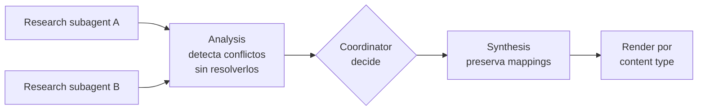

---
tags:
  - claude-cert/dominio-5
  - task-statement/5.6
---

# 2 example — Information Provenance & Multi-Source Synthesis

Aplicación práctica de [[1 resumen]]

Vamos a construir, paso a paso, un pipeline de investigación multi-agente sobre "inversión en energías renovables" que preserva la procedencia de cada dato de punta a punta. El caso aplica las siete conclusiones del resumen: structured claim-source mappings, preservación de la atribución a través del pipeline (sobre todo en la síntesis), conflict handling, completar el análisis con los conflictos intactos, temporal awareness, secciones well-established vs contested, y content-appropriate rendering.

Usamos Python y el SDK oficial de Anthropic (`anthropic`), con la forma real de la Messages API: `tools` con `input_schema` y `tool_choice` forzado para obtener structured output.



## Paso 1 — El schema del claim-source mapping

Todo empieza con el formato. Definimos una tool cuyo `input_schema` obliga a cada hallazgo a traer los 5 campos de la [[1 resumen#1. Structured claim-source mappings|Conclusión 1]]: `claim`, `sourceUrl`, `documentName`, `relevantExcerpt`, `publicationDate`. Agregamos cuatro campos de apoyo para el pipeline: `metric` y `value` (para detectar conflictos sobre la misma medida), `dataPeriod` (periodo que cubren los datos, para la [[1 resumen#5. Temporal awareness: fechas distintas explican números distintos|Conclusión 5]]) y `contentType` (para el rendering de la [[1 resumen#7. Content-appropriate rendering|Conclusión 7]]).

```python
import json
import anthropic

client = anthropic.Anthropic()
MODEL = "claude-sonnet-5"

CLAIM_SOURCE_MAPPING = {
    "type": "object",
    "properties": {
        "claim": {"type": "string", "description": "La afirmación específica, con cifras exactas si existen."},
        "sourceUrl": {"type": "string", "description": "URL donde se encontró la información."},
        "documentName": {"type": "string", "description": "Título del documento fuente."},
        "relevantExcerpt": {"type": "string", "description": "Pasaje literal de la fuente que sostiene el claim."},
        "publicationDate": {"type": "string", "description": "Fecha de publicación o de recolección de datos (YYYY-MM-DD)."},
        "dataPeriod": {"type": "string", "description": "Periodo que cubren los datos, p. ej. 'calendar year 2023' o 'Jul 2022–Jun 2023'."},
        "metric": {"type": ["string", "null"], "description": "Nombre normalizado de la medida, p. ej. 'renewable_investment_growth_pct'. null si el claim no es cuantitativo."},
        "value": {"type": ["string", "null"], "description": "Valor numérico tal como aparece en la fuente."},
        "contentType": {"type": "string", "enum": ["financial", "news", "technical"]},
    },
    # Los 5 campos de procedencia son required: no son metadata opcional.
    "required": ["claim", "sourceUrl", "documentName", "relevantExcerpt",
                 "publicationDate", "dataPeriod", "metric", "value", "contentType"],
}

REPORT_FINDINGS_TOOL = {
    "name": "report_findings",
    "description": "Reporta todos los hallazgos de la investigación. Cada hallazgo debe llevar su claim-source mapping completo.",
    "input_schema": {
        "type": "object",
        "properties": {"findings": {"type": "array", "items": CLAIM_SOURCE_MAPPING}},
        "required": ["findings"],
    },
}
```

> [!warning] Pregunta trampa en código — hacer opcionales los campos de procedencia
> La forma ingenua sería `"required": ["claim"]` y dejar `sourceUrl`, `relevantExcerpt` y `publicationDate` como "nice to have". **Por qué es mala idea:** el modelo los omitirá justo cuando más cuesta encontrarlos, y cualquier hallazgo sin fuente o sin fecha ya no se puede rastrear ni interpretar temporalmente. La procedencia es la garantía estructural del sistema, no metadata opcional.

## Paso 2 — Research subagents que devuelven estructura, no prosa

Cada subagente investiga un aspecto distinto y **está forzado** a responder con `report_findings` vía `tool_choice`. Así la atribución existe desde el primer paso del pipeline ([[1 resumen#2. La atribución muere en la summarisation (y hay que cargarla por todo el pipeline)|Conclusión 2]], paso 1).

```python
RESEARCH_SYSTEM = """Eres un subagente de investigación.
Reporta cada hallazgo con su claim-source mapping completo:
- Copia el relevantExcerpt LITERAL de la fuente; no lo parafrasees.
- Incluye siempre publicationDate y dataPeriod. Si la fuente no los indica, dilo explícitamente en dataPeriod ("not stated").
- No combines cifras de fuentes distintas en un solo claim."""


def run_research_subagent(aspect: str, source_documents: list[dict]) -> list[dict]:
    docs_block = "\n\n".join(
        f'<document name="{d["name"]}" url="{d["url"]}" published="{d["published"]}">\n{d["text"]}\n</document>'
        for d in source_documents
    )
    response = client.messages.create(
        model=MODEL,
        max_tokens=4096,
        system=RESEARCH_SYSTEM,
        tools=[REPORT_FINDINGS_TOOL],
        tool_choice={"type": "tool", "name": "report_findings"},
        messages=[{
            "role": "user",
            "content": f"Investiga: {aspect}\n\nFuentes disponibles:\n{docs_block}",
        }],
    )
    tool_use = next(b for b in response.content if b.type == "tool_use")
    return tool_use.input["findings"]


findings_a = run_research_subagent("Crecimiento de la inversión global en renovables", iea_docs)
findings_b = run_research_subagent("Tendencias del mercado de renovables según analistas", bnef_docs)
```

> [!warning] Pregunta trampa en código — el subagente devuelve un resumen en prosa
> La forma ingenua: `messages.create(...)` sin tools y con el prompt "Resume lo que encontraste sobre inversión en renovables", pasando `response.content[0].text` al siguiente agente. **Por qué es mala idea:** si el subagente devuelve prosa, la atribución ya se perdió **antes** de llegar a la síntesis; ningún paso posterior puede reconstruir qué URL, qué excerpt y qué fecha respaldan cada frase.

## Paso 3 — Analysis: detectar conflictos sin resolverlos

El paso de análisis agrupa los hallazgos por `metric` y, si hay valores distintos para la misma medida, produce un registro de conflicto con **todos** los valores y su contexto, igual que el JSON de la guía ([[1 resumen#4. Completar el análisis con los conflictos intactos|Conclusión 4]]). No elige ninguno.

```python
from collections import defaultdict


def analyze_findings(findings: list[dict]) -> dict:
    by_metric: dict[str, list[dict]] = defaultdict(list)
    non_quantitative = []
    for f in findings:
        (by_metric[f["metric"]] if f["metric"] else non_quantitative).append(f)

    conflicts, consistent = [], []
    for metric, items in by_metric.items():
        distinct_values = {i["value"] for i in items}
        if len(distinct_values) > 1:
            conflicts.append({
                "field": metric,
                "conflictDetected": True,
                "values": [
                    {
                        "value": i["value"],
                        "source": i["documentName"],
                        "sourceUrl": i["sourceUrl"],
                        "publicationDate": i["publicationDate"],
                        "context": i["dataPeriod"],
                    }
                    for i in items
                ],
                "possibleExplanation": explain_difference(items),  # Paso 4
            })
        else:
            consistent.append({"metric": metric, "findings": items})

    return {"conflicts": conflicts, "consistent": consistent, "qualitative": non_quantitative}
```

> [!warning] Pregunta trampa en código — "resolver" el conflicto dentro del análisis
> Las tres formas ingenuas que el examen usa como distractores:
> ```python
> # ❌ Elegir la fuente más reciente
> chosen = max(items, key=lambda i: i["publicationDate"])
> # ❌ Promediar
> chosen_value = sum(float(i["value"].rstrip("%")) for i in items) / len(items)
> # ❌ Elegir el publisher "más autoritativo"
> chosen = next(i for i in items if "IEA" in i["documentName"])
> ```
> **Por qué es mala idea:** las tres destruyen información y presentan falsa certeza — el lector ya no sabe que había otra cifra creíble. Además, decidir no es responsabilidad del analysis agent: debe completar su trabajo con los valores en conflicto incluidos y anotados, y dejar la decisión al coordinator.

## Paso 4 — Temporal awareness: ¿contradicción o tendencia?

Antes de etiquetar algo como conflicto, miramos las fechas. Si los datos cubren **periodos distintos**, la diferencia puede ser una tendencia; lo anotamos como posible explicación en vez de marcarlo como problema de calidad ([[1 resumen#5. Temporal awareness: fechas distintas explican números distintos|Conclusión 5]]).

```python
def explain_difference(items: list[dict]) -> str:
    periods = {i["dataPeriod"] for i in items}
    if "not stated" in periods:
        return ("At least one source does not state its data period; "
                "the difference cannot be interpreted temporally without it.")
    if len(periods) > 1:
        ordered = sorted(items, key=lambda i: i["publicationDate"])
        trend = " → ".join(f'{i["value"]} ({i["dataPeriod"]}, {i["documentName"]})' for i in ordered)
        return (f"Sources cover different periods ({trend}). "
                "The difference may reflect a trend over time or different reporting periods, "
                "not necessarily a contradiction.")
    return ("Sources cover the same period; the difference may reflect "
            "different methodologies (e.g. audited vs preliminary figures).")
```

> [!warning] Pregunta trampa en código — comparar valores sin mirar fechas
> La forma ingenua es `if a["value"] != b["value"]: flag_as_data_quality_issue(...)`. **Por qué es mala idea:** 8% en datos de 2023 y 12% en datos de 2024 no se contradicen, muestran aceleración. Sin `publicationDate`/`dataPeriod` en el output estructurado, el sistema marca o suprime hallazgos que en realidad son consistentes. Por eso en el Paso 1 esos campos son `required`.

## Paso 5 — El coordinator decide qué hacer con cada conflicto

La reconciliación ocurre en el coordinator, **antes** de la síntesis. Sus opciones son exactamente las de la guía: presentar ambos valores, investigar más o escalar a un humano.

```python
HIGH_STAKES_METRICS = {"annual_revenue", "renewable_investment_usd_bn"}


def coordinator_resolve(analysis: dict, human_review_queue: list) -> dict:
    for conflict in analysis["conflicts"]:
        periods = {v["context"] for v in conflict["values"]}
        if "not stated" in periods:
            conflict["decision"] = "investigate"          # falta contexto: pedir más investigación
        elif conflict["field"] in HIGH_STAKES_METRICS:
            conflict["decision"] = "escalate"             # cifra crítica: analista humano
            human_review_queue.append(conflict)
        else:
            conflict["decision"] = "present_both"         # default: mostrar ambos con atribución
    return analysis
```

> [!note] Separación de responsabilidades
> El analysis agent **detecta y anota**; el coordinator **decide**; el synthesis agent **presenta**. Ninguno de los tres elige silenciosamente un valor.

## Paso 6 — Synthesis que preserva y mergea los mappings

Este es el paso 3 del pipeline, el **punto de falla más común** ([[1 resumen#2. La atribución muere en la summarisation (y hay que cargarla por todo el pipeline)|Conclusión 2]]). Le damos al synthesis agent un ID por fuente, le exigimos que cada claim cite IDs, y le pedimos secciones separadas de well-established vs contested ([[1 resumen#6. Reportes que distinguen lo well-established de lo contested|Conclusión 6]]).

Primero clasificamos: un hallazgo es *well-established* si lo sostienen **al menos dos documentos independientes** sin conflicto; si lo sostiene uno solo, se marca como single-source.

```python
def build_source_registry(findings: list[dict]) -> dict[str, dict]:
    registry = {}
    for f in findings:
        key = f["sourceUrl"]
        if key not in registry:
            registry[key] = {"id": f"S{len(registry) + 1}", **{k: f[k] for k in ("documentName", "sourceUrl", "publicationDate")}}
    return registry


def classify_support(analysis: dict) -> dict:
    established, single_source = [], []
    for group in analysis["consistent"]:
        docs = {f["documentName"] for f in group["findings"]}
        (established if len(docs) >= 2 else single_source).append(group)
    return {"established": established, "single_source": single_source}
```

Luego la llamada de síntesis, también con structured output para poder verificar las citas:

```python
SYNTHESIS_SYSTEM = """Eres el synthesis agent de un sistema de investigación.
Reglas de procedencia (obligatorias):
1. Cada claim del reporte DEBE citar uno o más source IDs (S1, S2, ...) del registro de fuentes.
2. No introduzcas ningún claim que no provenga de los hallazgos recibidos.
3. Conserva cifras, fechas y la caracterización original de cada fuente; no generalices
   ("creció significativamente") cuando la fuente da un número.
4. Para conflictos con decision=present_both: muestra TODOS los valores, cada uno con su fuente,
   fecha y periodo, más la possibleExplanation. Nunca elijas uno.
5. Separa las secciones "Well-established findings" (2+ fuentes independientes) y
   "Contested or single-source findings"."""

SECTION_SCHEMA = {
    "type": "object",
    "properties": {
        "sections": {
            "type": "array",
            "items": {
                "type": "object",
                "properties": {
                    "heading": {"type": "string"},
                    "status": {"type": "string", "enum": ["established", "contested", "single_source"]},
                    "contentType": {"type": "string", "enum": ["financial", "news", "technical"]},
                    "claims": {
                        "type": "array",
                        "items": {
                            "type": "object",
                            "properties": {
                                "text": {"type": "string"},
                                "sourceIds": {"type": "array", "items": {"type": "string"}, "minItems": 1},
                                "year": {"type": ["string", "null"]},
                                "value": {"type": ["string", "null"]},
                            },
                            "required": ["text", "sourceIds", "year", "value"],
                        },
                    },
                },
                "required": ["heading", "status", "contentType", "claims"],
            },
        }
    },
    "required": ["sections"],
}


def run_synthesis(analysis: dict, support: dict, registry: dict) -> dict:
    payload = {
        "sourceRegistry": list(registry.values()),
        "establishedFindings": support["established"],
        "singleSourceFindings": support["single_source"],
        "conflicts": [c for c in analysis["conflicts"] if c["decision"] == "present_both"],
        "qualitativeFindings": analysis["qualitative"],
    }
    response = client.messages.create(
        model=MODEL,
        max_tokens=8192,
        system=SYNTHESIS_SYSTEM,
        tools=[{"name": "write_report", "description": "Entrega el reporte sintetizado.", "input_schema": SECTION_SCHEMA}],
        tool_choice={"type": "tool", "name": "write_report"},
        messages=[{"role": "user", "content": json.dumps(payload, ensure_ascii=False)}],
    )
    return next(b for b in response.content if b.type == "tool_use").input
```

Y una verificación determinista de que ningún claim quedó sin rastro:

```python
def verify_traceability(report: dict, registry: dict) -> list[str]:
    valid_ids = {s["id"] for s in registry.values()}
    problems = []
    for section in report["sections"]:
        for claim in section["claims"]:
            unknown = set(claim["sourceIds"]) - valid_ids
            if not claim["sourceIds"] or unknown:
                problems.append(f'Untraceable claim in "{section["heading"]}": {claim["text"]}')
    return problems
```

> [!warning] Pregunta trampa en código — "Resume estos hallazgos en un reporte"
> La forma ingenua del synthesis agent:
> ```python
> # ❌ Pasa solo los claims, sin fuentes, y pide un resumen libre
> text = "\n".join(f["claim"] for f in all_findings)
> client.messages.create(model=MODEL, max_tokens=4096,
>     messages=[{"role": "user", "content": f"Resume estos hallazgos en un reporte:\n{text}"}])
> ```
> **Por qué es mala idea:** es exactamente como muere la atribución — el modelo comprime y parafrasea ("la inversión en renovables creció significativamente"), sin monto, sin fuente, sin fecha. Tampoco distingue consenso de dato disputado. El prompt de síntesis debe **exigir explícitamente** que cada claim sea rastreable, y hay que pasarle los mappings, no solo los claims.

## Paso 7 — Content-appropriate rendering

El renderer final elige formato según `contentType` ([[1 resumen#7. Content-appropriate rendering|Conclusión 7]]): tablas para financial data, prosa para news, listas para technical findings. Las citas viajan con cada claim.

```python
def cite(ids: list[str], registry_by_id: dict) -> str:
    return "; ".join(
        f'{registry_by_id[i]["documentName"]}, {registry_by_id[i]["publicationDate"]}' for i in ids
    )


def render_section(section: dict, registry_by_id: dict) -> str:
    out = [f'### {section["heading"]}']
    if section["contentType"] == "financial":
        out.append("| Year | Value | Source |\n|---|---|---|")
        for c in section["claims"]:
            out.append(f'| {c["year"]} | {c["value"]} | {cite(c["sourceIds"], registry_by_id)} |')
    elif section["contentType"] == "news":
        out.append(" ".join(f'{c["text"]} [{", ".join(c["sourceIds"])}]' for c in section["claims"]))
    else:  # technical
        out.extend(f'- {c["text"]} [{", ".join(c["sourceIds"])}]' for c in section["claims"])
    return "\n".join(out)


def render_report(report: dict, registry: dict) -> str:
    registry_by_id = {s["id"]: s for s in registry.values()}
    parts = ["## Well-established findings"]
    parts += [render_section(s, registry_by_id) for s in report["sections"] if s["status"] == "established"]
    parts.append("## Contested or single-source findings")
    parts += [render_section(s, registry_by_id) for s in report["sections"] if s["status"] != "established"]
    parts.append("## Sources")
    parts += [f'- **{s["id"]}** — {s["documentName"]} ({s["publicationDate"]}) — {s["sourceUrl"]}' for s in registry.values()]
    return "\n\n".join(parts)
```

> [!warning] Pregunta trampa en código — un solo formato para todo
> La forma ingenua: `"\n".join(f"- {c['text']}" for s in sections for c in s["claims"])` — todo como bullets (o todo como párrafos). **Por qué es mala idea:** una serie de inversión 2021–2023 en bullets obliga a leer número por número para comparar; una noticia con causa-efecto partida en bullets pierde su narrativa. Aplanar a un formato uniforme degrada la legibilidad.

## Paso 8 — Orquestación completa

```python
def run_pipeline(iea_docs, bnef_docs):
    # 1. Research: structured claim-source mappings desde el origen
    findings = (
        run_research_subagent("Crecimiento de la inversión global en renovables", iea_docs)
        + run_research_subagent("Tendencias del mercado de renovables según analistas", bnef_docs)
    )
    # 2. Analysis: conflictos detectados y anotados, nunca resueltos
    analysis = analyze_findings(findings)
    # 3. Coordinator: decide present_both / investigate / escalate antes de síntesis
    human_queue: list = []
    analysis = coordinator_resolve(analysis, human_queue)
    # 4. Synthesis: mappings preservados, established vs contested
    registry = build_source_registry(findings)
    report = run_synthesis(analysis, classify_support(analysis), registry)
    problems = verify_traceability(report, registry)
    if problems:
        raise ValueError("Synthesis lost attribution:\n" + "\n".join(problems))
    # 5. Rendering por tipo de contenido, con sección de fuentes
    return render_report(report, registry), human_queue
```

Un conflicto de crecimiento terminaría renderizado así en la sección "Contested":

```markdown
### Market growth estimates vary by source
- **12% growth** — IEA World Energy Report (published 2024-06-15, calendar year 2023 data) [S1]
- **8% growth** — Bloomberg NEF Annual Review (published 2024-03-01, Jul 2022–Jun 2023 data) [S2]
- The difference may reflect different reporting periods and methodological approaches.
```

Con esto el flujo cubre todo el resumen: cada hallazgo nace con su mapping completo, la atribución sobrevive la síntesis (y se verifica), los conflictos se anotan sin elegir un valor, el coordinator decide antes de sintetizar, las fechas separan tendencias de contradicciones, el reporte distingue consenso de disputa, y cada tipo de contenido se presenta en su formato natural.
